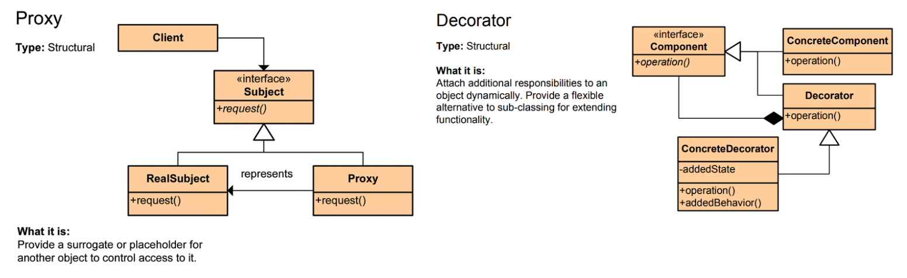
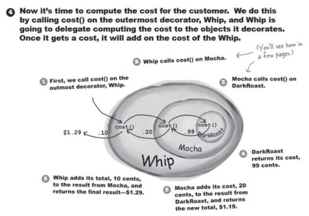
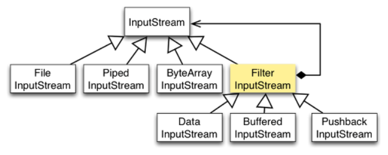

Decorator 패턴
===========
10주차
- - - - - -
* 일시: 2019.07.17(수)
* 장소: 건대 엔젤리너스
* 참여인원: 
* 내용: 아래 참고
 

### 목차
1. [개념](#개념)
2. [적용](#적용)

### 개념(https://ko.wikipedia.org/wiki/%EB%8D%B0%EC%BB%A4%EB%A0%88%EC%9D%B4%ED%84%B0_%ED%8C%A8%ED%84%B4)
* [주어진 상황 및 용도에 따라 어떤 객체에 책임을 덧붙이는 패턴]
	* 장점
		* [기능 확장이 필요할 때 서브클래싱 대신 쓸 수 있는 유연한 대안](https://gdtbgl93.tistory.com/9)
	* 단점
		* 일반적인 상속관계보다 유연한 기능 확장이 가능하지만 겹겹이 애워싼 구조때문에 디버깅 어려움
* 패턴 비교: [Proxy vs Decorator](https://hamait.tistory.com/868)
	* 두 패턴 모두 기존에 존재하는 객체의 동일한 인터페이스(구체적으로 메소드)를 이용해서 다양한 행위를 추가하기 위한 의도
	* 단 프록시 패턴은 흐름 제어만 할 뿐 반환값을 수정하지는 않지만, 데코레이터 패턴은 반환값을 조작 후 반환
	* UML  
	  
	* 참고 
		* [집합관계: 합성 vs 집약](https://defacto-standard.tistory.com/104)

### 적용
1. 카페 커피 주문 예시
	* 소스 참고
	* 설명  
	
		* 호출과 리턴이 역순으로 일어남을 확인 가능
2. 자바 API
	* Stream  
	
3.