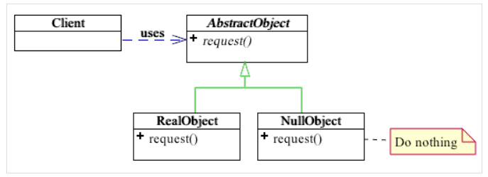

Null Object 패턴
===========
6주차
- - - - - -
* 일시: 2019.06.19(수)
* 장소: 강남 카페나인
* 참여인원: 4인
* 내용: 아래 참고
</br>

* 개요
	1. 개념
		* 동작 패턴 중 하나(one of the behavioral patterns)
		* 값이 없거나 0인 오브젝트를 정의해 Null의 행위를 정의
			* 어떤 종류의 실패에 대해 Null이나 0을 반환하는 경우와 다름
			* 함수가 실패할 경우 반환하는 객체는 '아무 일'도 하지 않음
	2. 목적(동기)
		* 메소드 내부에서 참조 점검 불필요
			* 객체 지향 언어(Java 또는 C#)에서 참조가 Null일 수 있음
			* 따라서 메소드 구현 전 Null 여부 점검 필요
		* 코드 간편화
			* 수신된 객체는 모두 동일한 방식으로 사용되므로 클라이언트에게 중요치 않음
				* 수신된 객체가 Null 객체든 실제 객체든 상관없음
				* 분기문 및 예외처리문 사용 불필요
			* 클라이언트는 추상 클래스의 구현을 수신하여 이를 사용
				* 수신된 객체란 추상 클래스의 구현
	3. 예
		* 폴더에 있는 파일 목록 검색 후 각 파일에 대해 작업 수행
			* 비어있는 폴더의 경우 → Null 반환
		* 데이터베이스와 같은 특정 기능의 가용성을 테스트
			* 코드  
			  ```java
			  Employee e = DB.getEmployee("Bob");
			  if(e.isTimeToPay(today)) {
				e.pay();
			  }
			  ```
			* [질문]()
				* 물론 DB.getEmployee()가 어떤 직원을 찾는 데 실패했는지 알고 싶은 경우도 많을 것임  
				  이는 NullEmployee의 유일한 인스턴스를 저장하는 Employee의 정적 final 변수를 만드는 것으로 해결 가능
	4. 구조
		* 목적 中 코드 간편화를 설명  
		  
	5. 추가
		* [싱글톤 패턴을 사용하여 널 객체 구현]()
			* 널 객체는 변하지 않는 상수이기 때문
		* 여러 종류의 Null을 가질 수 있음
			* 예1
				* NoCustomer: 고객이 없는 경우
				* UnKnownCustomer: 누군가 있는 건 알지만, 그게 누구인지 모르는 경우
		* [토의](https://github.com/nara1030/DesignPattern/blob/master/study/week6_NullObject/etc.md)
			

* 레퍼런스
	1. [Java의 Null Object Pattern](https://www.dineshonjava.com/null-object-pattern/)
	2. [Null Object 패턴](https://dsmoon.tistory.com/entry/NULL-OBJECT-%ED%8C%A8%ED%84%B4)
	3.
</br>