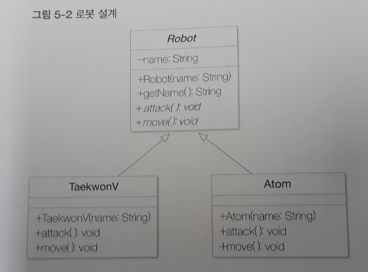
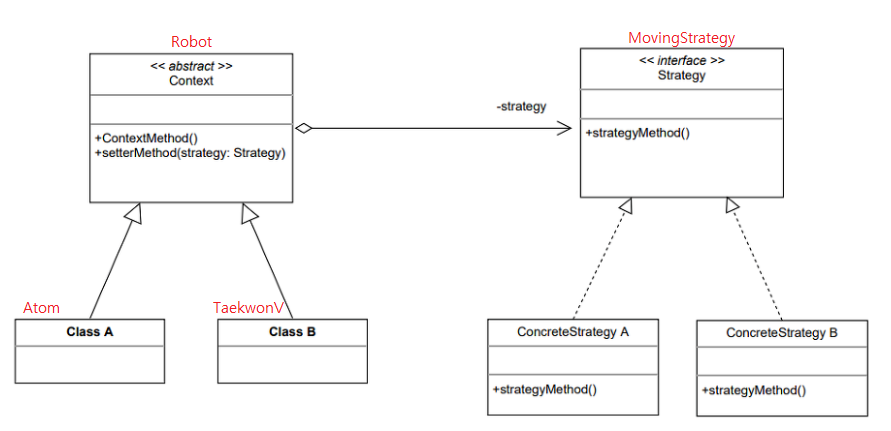
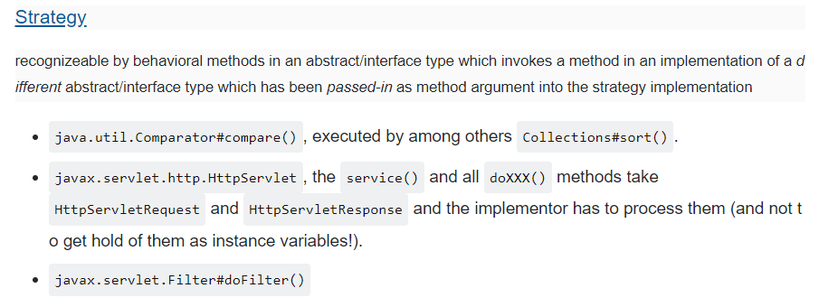

Strategy 패턴
===========
7주차
- - - - - -
* 일시: 2019.06.26(수)
* 장소: 강남 카페나인
* 참여인원: 6인
* 내용: 아래 참고
 

* Strategy 패턴
	1. 개요
		* 각양각색 로봇 만들기
			* 방법 1. 로봇들을 추상 클래스의 자식 클래스로 구현
				* 클래스 다이어그램  
				  
				* 문제점
					* 기존 기능 변경하고 싶을 때 OCP(Open-Closed Principle) 위배
					* 새로운 기능 추가하고 싶을 때 중복 코드 발생
				* 해결책
					* 무엇이 변화되었는지를 찾은 후에 이를 클래스로 캡슐화
			* 방법 2. 로봇의 기능을 캡슐화해서 로봇 클래스에서 교환해서 사용
				* 클래스 다이어그램  
				  
				* 목적
					* 동일한 문제를 다른 방식으로 해결할 수 있게 하는 디자인 패턴
					* 예를 들어 게임 캐릭터가 자신이 처한 상황에 따라 공격이나 행동하는 방식을 바꾸기 위해 사용
				* 단계
					1. 로봇 클래스(추상 클래스)에서 변화하는 부분 분리 후 캡슐화
						* Robot 클래스 입장에서 보면 구체적인 이동 방식이 MovingStrategy 인터페이스에 의해 캡슐화되어 있음
						* 캡슐화는 왜?
							* 새로운 공격 방식이 개발되어 현재 로봇에 제공하더라도 MovingStrategy 인터페이스가 변화에 대한 일종의 방화벽 역할을 수행해 Robot 클래스의 변경을 차단
								* 즉, OCP 만족하는 설계
							* 캡슐화 ≠ 은닉화
					2. 외부에서 로봇 객체의 이동 방식을 임의로 바꿀 수 있도록 해주는 메서드 생성
						* Robot 클래스에 setMovingStrategy 메서드 정의
							* 로봇의 이동 방식을 필요할 때 바꿀 수 있도록 하기 위함
							* 이것이 가능한 이유는 일반화 관계(상속) 대신 집약 관계를 이용했기 때문
	2. 적용
		* Strategy 패턴을 사용하고 있는 Java API  
		  
			* [출처](https://victorydntmd.tistory.com/292)
	3. 참고
		* [Strategy 패턴](https://www.crocus.co.kr/1526)
		* 개방-폐쇄 원칙

* 기타
	1. 캡슐화 vs. 은닉화
		* 위 참조
	2. 집약 관계 vs. 합성 관계
		* .
	3. 추상클래스 vs. 인터페이스
		* [Java 8 인터페이스](https://blog.powerumc.kr/473)
	4. 템플릿메서드 vs. 전략
		* [같은 문제에 대한 해결책의 차이..?](https://limkydev.tistory.com/84)