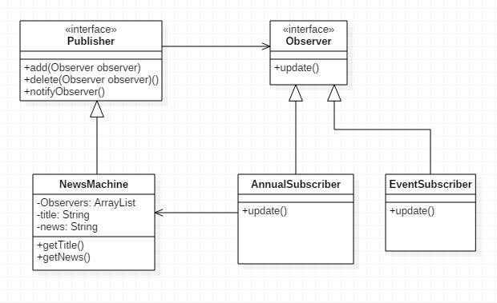

Observer 패턴
===========
8주차
- - - - - -
* 일시: 2019.07.03(수)
* 장소: 건대 엔젤리너스
* 참여인원: 4인
* 내용: 아래 참고
 

### 개요
1. 개념
	* 옵저버 패턴이란
		* 한 객체의 상태가 바뀌면 그 객체에 의존하는 다른 객체들에게 연락이 가고 자동으로 정보가 갱신되는 1:N 관계
			* 주체 객체(Observable/Publisher/Subject): 상태를 가지고 있음
			* 관찰 객체(Observer/Subscriber/Listener): 상태의 변경을 알아야 함
		* 이 두 객체의 연결(의존)은 인터페이스를 이용하여 느슨한 결합성(Loose Coupling)을 유지
			* 즉 상속 관계(일반화 관계)가 아닌 구성(Composition)을 이용해 구현
			* 전략 패턴과 유사
		* 간단한 예로, 매일 새로운 뉴스를 제공하는 뉴스머신과 그 구독자를 생각해볼 수 있음
		* 발행/구독 모델이라고도 함
	* 구조
		* 다이어그램  
		
		* 설명
			* 각 인터페이스에 대해 구현을 했는데, 화살표의 방향이 반대인 이유가 뭘까?
				* Publisher → Observer
				* NewsMachine ← AnnualSubscriber(EventSubscriber)
			* 클래스 다이어그램이 뉘앙스를 설명해주진 못한다(임시 결론)
				* 화살표의 방향은 뉘앙스가 중요
				* Publisher → Observer
					* 구독을 원하는 Observer를 관리(정보 제공 위해)할 필요가 있기 때문에 멤버 변수로 선언
				* NewsMachine ← AnnualSubscriber(EventSubscriber)
					* 구독 여부(구독하고 싶어! 구독하기 싫어!)의 주체는 Subscriber임
					* 따라서 Subscriber의 생성자에 Publisher의 add 메서드 추가
						* 즉, 양방향 연관관계
	* 상세
		1. 자바 API
			* 자바에서는 옵저버 패턴을 적용한 것을 기본적으로 제공해주기 때문에 쉽게 구현 가능
				* Observable 클래스와 Observer 인터페이스
			* 단, Observable이 인터페이스가 아닌 클래스로 구현되어 있기 때문에 다중 상속 이슈가 있음
		2. 두 가지 방식: Push & Pull
			* Push: Publisher에서 정보(상태)가 변경될 때마다 Observer에게 보내는 방식
			* Pull: Observer에서 정보가 필요할 때마다 Publisher에게 요청하는 방식
2. 적용
	* 예제 소스는 스터디 발표자분의 소스인데 공부 용도로 발췌
	* 각종 이벤트 받을 때
		* 자바
			* 스윙
		* 안드로이드
			* View 혹은 Button

### 토의
* 이더리움(?)은 옵저버 패턴과 연관이 있음
* 자바스크립트는 비동기 언어
	* 반대로 자바는 동기 언어
	* 콜백함수의 등장
* HTTP-2
* 기타
	* 만약 이 내용을 절차 지향 언어로 짠다면 어떻게 짜야 되는 거지?
	* 위키 설명 발췌
		* 이 패턴의 핵심은 옵저버 또는 리스너라 불리는 하나 이상의 객체를 관찰 대상이 되는 객체에 등록시킨다.
		* 그리고 각각의 옵저버들은 관찰 대상인 객체가 발생시키는 이벤트를 받아 처리한다.
			* 다른 표현으로, 이벤트가 발생하면 각 옵저버는 콜백을 받는다.
			* 각각의 파생 옵서버는 nofify 함수를 구현함으로써 이벤트가 발생했을 때 처리할 각자의 동작을 정의해야 한다.
	* 옵서버 패턴이 많이 쓰인 시스템에서는 순환 실행을 막는 메커니즘이 필요

### 참고
* [디자인 패턴 - 옵저버 패턴](https://flowarc.tistory.com/entry/%EB%94%94%EC%9E%90%EC%9D%B8-%ED%8C%A8%ED%84%B4-%EC%98%B5%EC%A0%80%EB%B2%84-%ED%8C%A8%ED%84%B4Observer-Pattern)
* [옵저버 패턴이란](https://gmlwjd9405.github.io/2018/07/08/observer-pattern.html)
* [위키백과 - 옵서버 패턴](https://ko.wikipedia.org/wiki/%EC%98%B5%EC%84%9C%EB%B2%84_%ED%8C%A8%ED%84%B4)