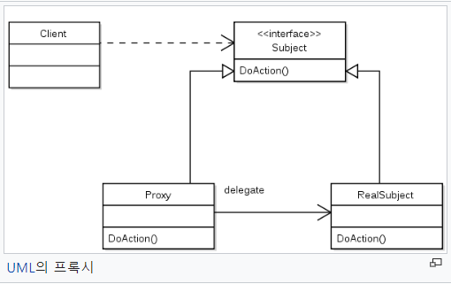

Proxy 패턴
===========
9주차
- - - - - -
* 일시: 2019.07.10(수)
* 장소: 건대 엔젤리너스
* 참여인원: 4인
* 내용: 아래 참고
 

### 개요
1. 왜 쓰여?(Why)
	* 몇 가지 상황
		* 게임 로딩 시 시간이 오래 걸리는 경우(백그라운드 처리)
			* 즉, 무거운 객체를 로딩해야 하는 경우 이 데이터는 스레드 생성해 돌려줌
		* 인가 처리(실제 요청 전 혹은 후)
			* 스프링 AOP
		* 원격 메서드 호출 위한 작업(원격 프록시)

2. 뭔데?(What)
	* 개념
		* 일반적으로 프록시는 다른 무언가와 이어지는 인터페이스의 역할을 하는 클래스
			* 실제 작업을 행하는 오브젝트를 감싼다고도 표현 가능
		* 일종의 비서역할을 하는 객체로, 흐름제어만 할 뿐 결과값을 변경하거나 조작하면 안됨
	* 구조(UML)  
		
		* 프록시 객체가 실제 요청 처리 객체와 같은 인터페이스를 구현하고 있는 구조
			* 프록시 패턴 이전에 객체 지향의 기본인 유연성 높은 코드를 확인 가능
			* 기본적으로 인터페이스를 이용해 설계하려는 자바의 특성상 UML로는 디자인 패턴의 의도는 알 수 없음
				* [객체지향 설계란](https://limkydev.tistory.com/77): High Cohesion & Loose Coupling
	* 특징
		1. 프록시 객체(이하 대리자)는 실제 서비스(API)와 같은 이름의 메서드, 즉 인터페이스를 구현한다.
		2. 대리자는 실제 서비스(인터페이스)에 대한 참조 변수를 갖는다.
		3. 대리자는 실제 서비스와 같은 이름을 가진 메서드를 호출하고 그 값을 클라이언트에게 돌려준다.
		4. 대리자는 실제 서비스의 메서드 호출 전후에도 별도의 로직을 수행할 수 있다.
			* 대리자는 무거운 객체가 로딩되는 동안 가벼운 다른 화면들을 띄울 수 있다.
			* 즉, 대리자 객체에 다른 메서드들이 추가될 수 있다(는 의미로 이해했다).

### 토의
1. 개념
	* 메모리 절약 - 프록시 내 오버라이드 메소드에서 Null 체크
		* Null이 아닐 땐 멤버 변수에 참조된 객체를 그대로 재사용
	* 플라이웨이트 패턴
		* 복합적인 오브젝트들의 다수의 복사본이 존재해야만 하는 상황에서 프록시 패턴은 애플리케이션의 메모리 사용량을 줄이기 위해 플라이웨이트 패턴과 결합된 형태로 나올 수 있다.
	* 싱글톤의 단점
		* 대기
		* 흔히 DB 연결 응용 → DBCP ?
2. 응용
	* MSA
	* Spring AOP, 프록시, 인터셉터, 권한/인가
3. 기타
	* 도커의 두 가지 활용
		* 무중단 배포
	* Spring Security를 커스터마이징한다?
	* 용어
		* Thymeleaf
		* XML보단 JSON
			* 작스비(JAXB)
			* 잭슨(JACKSON)
		* 메이븐 vs. 그래들
		* 젠킨스
		* AWS
		* 감부스?

### 참고
1. 프록시 패턴
	* [프록시 패턴 1](https://limkydev.tistory.com/79)
	* [프록시 패턴 2](https://ko.wikipedia.org/wiki/%ED%94%84%EB%A1%9D%EC%8B%9C_%ED%8C%A8%ED%84%B4)
	* [프록시 패턴 3](https://ncanis.tistory.com/102)
	* [프록시 패턴 4](https://m.blog.naver.com/gracefulife/220650929598)
2. [배민 API GATEWAY - Spring Cloud zuul 적용기](http://woowabros.github.io/r&d/2017/06/13/apigateway.html)
3.